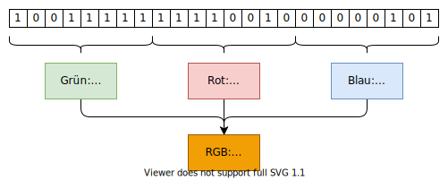
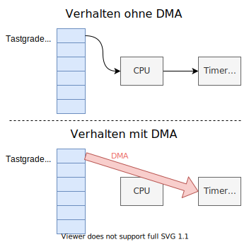

# Stadion-Anzeigetafel

## Steuerung der Anzeige

Die Anzeige besteht aus einer LED-Matrix mit 840 RGB LEDs. Die LEDs sind in Reihen auf LED-Streifen angebracht. Jede einzelne RGB LED besteht aus drei kleinen LEDs in den Farben Rot, Grün und Blau. Durch Kombination der einzelnen Farb-LEDs kann ein breites Farbspektrum erzeugt werden.

### WS2812B RGB LED Streifen

Auf den LED-Streifen sind WS2812B ICs angebracht, die die einzelnen LEDs steuern. Alle ICs sind in Reihe geschaltet. Vom Mikrocontroller werden nacheinander die Farbcodes für die einzelnen LEDs gesendet.

Der erste Chip empfängt das Steuersignal und verarbeitet den ersten Farbcode. Daraufhin enterfernt der IC den ersten Farbcode aus dem Steuersignal und gibt das resultierene Signal an die folgenden Chips weiter.
Die nächsten ICs wiederholen das Vorgehen. Somit wird das Steuersignal von Chip zu Chip kürzer, bis es den letzten Chip erreicht. Am Ende des Steuersignals wird ein Reset-Signal gesendet [3].

Abbildung: Ablauf der WS2812B Steuerung

### Benötigte Signale

Jeder Farbcode besteht aus 24 Bit beziehungsweise 3 Byte. In jedem Byte ist die Intensität einer Farbe enthalten. Im ersten Byte ist der Grünwert, im zweiten der Rotwert und im dritten Byte der Blauwert kodiert. Daraus entstehen drei Werte, die von 0 bis 256 reichen. Diese ergeben den RGB-Wert der LED [3].

Abbildung: Aufbau eines Farbcodes

Die 24 Bit je Farbcode werden elektrisch über ein Datenkabel an die Chips gesendet. Die Spannung auf dem Kabel wird entweder auf "high" oder "low" gesetzt (3,3 V oder 0 V). Je nachdem, wie lange das Signal im Zustand "high" und "low" verbringt, wird es als "0" oder "1" interpretiert. Die genauen Zeitverhältnisse sind in folgender Abbildung dargestellt [3].

Abbildung: Timing der Signale

Die Periode für das Senden einer 0/1-Signals beträgt 1,25 µs. Die high/low-Signale haben eine Toleranz von ±150 ns.

Nachdem die Farbcodes aller LEDs gesendet wurden, folgt ein Reset-Signal. Dazu wird die Datenleitung für mindestens 50 µs auf "low" gebracht [3].

### Erzeugung der Signale

Der Mikrocontroller verfügt über verschiedene Timer. Ein Timer mit PWM (Pulsweitenmodulation) Unterstützung wird für die Erzeugung der Steuersignale verwendet [2].

Die PWM-Periode muss wie gefordert auf 1,25 µs, was einer Frequenz von 800 kHz entspricht, gestellt werden.
Der Timer arbeitet mit einer Frequenz von 64 MHz.
Wenn der Timer innerhalb von einer Periode von 0 bis 79 zählt und dann zurückgesetzt wird, kann die erforderliche Frequenz erreicht werden.

Durch Einstellen des Tastgrades / Duty Cycles kann das Verhältnis von "high" und "low" innerhalb einer Periode geändert werden.

Bei einem Tastgrad von a = 0,32 wird ein "0"-Signal und bei einem Tastgrad von a = 0,64 ein "1"-Signal erzeugt.

#### Direct Memory Access

Der Tastgrad muss also ständig geändert werden.
Wenn die CPU dafür benutzt wird, kann nicht sichergestellt werden, dass das Timing eingehalten wird.
Es würde alle 1,25 µs ein gespeicherter Tastgrad-Wert geladen und ins Timer Register geschrieben werden.
Außerdem ist die CPU somit während dem Senden eines Signals durchgehend ausgelastet und kann nicht auf andere Signale reagieren.

Deshalb wird die DMA (Direct Memory Access) Funktion des Mikrocontrollers eingesetzt.
Diese schafft eine direkte Verbindung zwischen den Speicheradressen der Tastgrade und dem PWM Registers des Timers.
Die CPU startet zu Beginn die DMA-Verbindung.
Dann wird automatisch nach jeder Timer Periode der neue Tastgrad eingestellt [2].

Abbildung: Skizze Direct Memory Access

### Double Buffering

Insgesamt besitzt die Anzeigetafel 840 Pixel.
Wie beschrieben bekommt jeder Pixel ein 24 Bit langes Datensignal.
Für jedes Bit muss der Tastgrad angepasst werden.
Die Tastgrade werden in einem Array gespeichert und dann per DMA an den Timer gegeben.
In dem Array wird jeder Wert als `uint8_t` gespeichert und belegt somit 1 Byte des RAMs.

Das bedeutet, dass das Array eine Speichergröße von 840 * 24 Byte = 20,16 Kilobyte beansprucht.
Das übersteigt die Größe des RAMs des Mikrocontrollers (8 Kilobyte) bei weitem.

Double Buffering wird eingesetzt, um den Speicherbedarf stark zu verringern [4].

Statt ein Array mit allen Tastgraden anzulegen, wird lediglich ein Array mit 48 Einträgen erzeugt.
Dieses bietet Platz für die Tastgrade von genau zwei LEDs.

Der DMA wird im "Circle Mode" konfiguriert.
In diesem Modus sendet er das angegebene Array and die ausgewählte Peripherie und startet dann von vorne.

Dieses Verhalten wird ausgenutzt, um alle LEDs mit dem 48 Byte großen Array anzusteuern.
Zuerst werden die Tastgrade für LED 1 und LED 2 in das Array geladen und der DMA gestartet.
Sobald das Signal für LED 1 generiert wurde, beginnt der DMA, die Tastgrade für LED 2 weiterzugeben.
Währenddessen werden die Tastgrade für LED 1 mit den Tastgraden für LED 3 überschrieben.
Wenn LED 2 gesendet wurde, beginnt der DMA von vorne.
In der ersten Hälfte des Arrays stehen nun die Tastgrade für LED 3 und dadurch wird das dazugehörige Signal generiert.
Das Vorgehen wird wiederholt, bis die Signale für alle LEDs gesendet wurden [4].
Zuletzt wird der Tastgrad auf "0" gesetzt, um das Reset-Signal zu erzeugen.

Abbildung: Ablauf des DMA mit Double Buffering

Der DMA löst Interrupts aus, über die das Tastgrade-Array dann angepasst werden kann.
Wenn die erste Hälfte des Arrays gesendet wurde, wird die Funktion `HAL_TIM_PWM_PulseFinishedHalfCpltCallback` aufgerufen.
Wenn die zweite Hälfte des Arrays gesendet wurde, wird `HAL_TIM_PWM_PulseFinishedCallback` aufgerufen [1].
In diesen Funktionen kann dann das Array mit den neuen Tastgraden befüllt werden.

Abbildung: Auslösen der Interrupts/Callbacks

Die CPU wird beim DMA mit Double Buffering alle 30 µs verwendet.
Damit wird sie 24 Mal weniger belastet als beim Vorgehen ohne DMA.

Das Tastgrade-Array beinhaltet 48 32-Bit Zahlen.
Die Speichergröße beträgt damit 192 Byte.
Dabei spielt es keine Rolle, wie viele LEDs angesteuert werden.
Somit wird im Vergleich zum DMA ohne Double Buffering nur ein Hundertstel des Speicherplatzes verwendet.

## Referenzen

[1] STMicroelectronics, Description of STM32G0 HAL and low-layer drivers - User manual. 10-2020.

[2]
STMicroelectronics, STM32G0x1 advanced Arm®-based 32-bit MCUs - Reference manual. 11-2020.

[3] Worldsemi, WS2812B Datenblatt. 2021.

[4] M. Tilen, “Tutorial: Control WS2812B leds with STM32,” 2018-06-03. <https://stm32f4-discovery.net/2018/06/tutorial-control-ws2812b-leds-stm32/>
