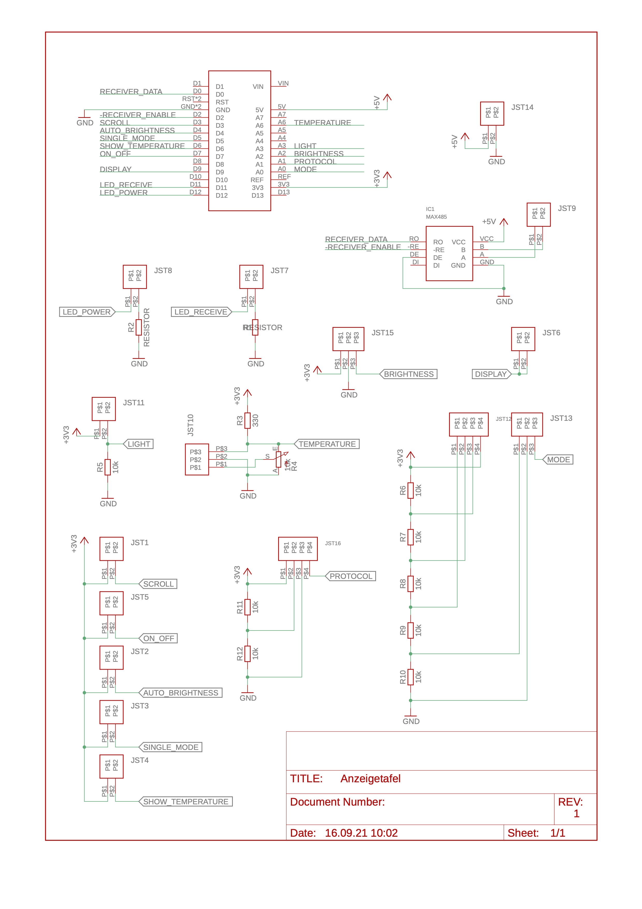
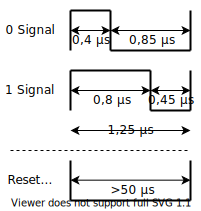
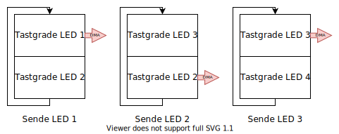
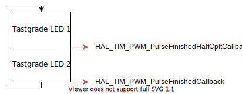

# Stadion-Anzeigetafel


## Zusammenfassung

Bei Leichtathletik Wettkämpfen erfolgt die Zeitmessung mit einer elektronischen Zeitmessanlage.
Der Startschuss startet die Stoppuhr und ein Zielbildauswerter bestimmt auf den Zielbildern die Zeiten der Läufer.

Während den Rennen wird auf einer Anzeigetafel die verstrichene Zeit dargestellt.
Außerdem können darauf nach einem Rennen die Zeiten der Läufer angezeigt werden.

In diesem Projekt wird eine Anzeigetafel entwickelt, die mit Zeitmesssystemen der Marke OMEGA kompatibel ist.
Die Anzeige kann eigenständig oder unterstützend eingesetzt werden.
Im eigenständigen Aufbau übernimmt sie alle Aufgaben der Anzeigetafel.
Im unterstützenden Modus werden Zusatzinformationen, wie der Name des Läufers, angezeigt, während eine weitere Anzeigetafel die Zeiten einblendet.


## Technische Daten

Die Namen-Anzeigetafel ist ein LED-Display, das bis zu 12 Buchstaben in einer Zeile anzeigen kann.
Es ist aus einer Distanz von bis zu 75 m lesbar.
Der Benutzer kann zwischen verschiedenen Modi wählen, um den Namen, die Bahn oder die Platzierung anzuzeigen.
Die Helligkeit der Anzeige wird automatisch an die aktuellen Lichtverhältnisse angepasst.
Das regensichere Gehäuse schützt die Elektronik auch bei schlechtem Wetter mit der Schutzklasse IP24.

## Aufbau

### LED Anzeige

Das Display besteht aus einer LED-Matrix.
Dafür werden individuell adressierbare LED-Streifen verwendet. Die LED-Streifen haben eine Dichte von 60 LEDs pro Meter.
Der Pixel-Abstand beträgt etwa 1,7 cm.
Die Anzeige hat eine Auflösung von 83 x 10 Pixeln.
Die Maße der Anzeige betragen etwa 140 x 17 cm.
Jeder Buchstabe ist damit 6 x 10 Pixel bzw. 10 cm x 17 cm groß.

### Mikrocontroller

Die Ergebnis-Daten werden von einem STM Mikrocontroller auf einem Nucleo-32 Board empfangen und aufbereitet.
Die Daten werden von der Zielbildauswertung über die serielle RS422 Schnittstelle bereitgestellt.
Der Mikrocontroller berechnet unter den gegeben Benutzer-Einstellungen die Steuerungssignale für das Display.

### Schnittstellen

Für den Daten-Empfang wird der Data-Out Anschluss der OMEGA-Anzeigetafel verwendet.
Die Verbindung erfolgt über ein Datenkabel mit einem siebenpoligem Tuchel-Anschluss.
Zum Programmieren des Mikrocontrollers ist außerdem ein USB Anschluss am Gehäuse angebracht.

### Automatische Helligkeitsregulierung

Die Helligkeit der Anzeige wird automatisch an die aktuellen Lichtverhältnisse angepasst.
Zur Ermittlung der Umgebungshelligkeit wird ein Fotowiderstand eingesetzt.
Bei starker Sonneneinstrahlung wird zur verbesserten Lesbarkeit die Helligkeit des Displays erhöht.
Bei Dunkelheit wird die Helligkeit verringert.

### Betriebsmodi

Die Anzeigetafel verfügt über verschiedene Betriebsarten.
Es kann entweder der Name oder die Startnummer und die Bahn angezeigt werden.
Über Schalter kann der Bediener auswählen, was angezeigt wird. Ein weiterer Schalter aktiviert das Scrollen von langen Namen, die nicht mit zehn Zeichen dargestellt werden können.
Über ein Potentiometer kann die Helligkeit manuell justiert werden.
Das Ein- und Ausschalten des Geräts ist ebenfalls über einen Schalter möglich.

### Spannungsversorgung

Sowohl der Arduino als auch die LED Streifen benötigen eine elektrische Spannung von 5 V. Diese wird über ein externes Netzteil bereitgestellt.

### Gehäuse

Das Gehäuse besteht aus PVC und bietet damit Schutz vor Regen in der Sicherheitsklasse IP24.
Die Vorderseite besteht aus einer dunklen Plexiglas Scheibe, um die gute Lesbarkeit der Anzeige zu ermöglichen.

## Schaltplan

Zum Einstellen des Modus werden Kippschalter, Potentiometer und Drehschalter verwendet.
Außerdem ermitteln Sensoren die Helligkeit und Temperatur.
Die Komponenten werden auf einer Platine mit dem Mikrocontroller und miteinander verbunden.

[Schaltplan](PCB-Eagle/Anzeigetafel-Schaltplan.pdf)

[PCB](PCB-Eagle/Anzeigetafel-PCB.pdf)



## Steuerung der Anzeige

Die Anzeige besteht aus einer LED-Matrix mit 840 RGB LEDs. Die LEDs sind in Reihen auf LED-Streifen angebracht. Jede einzelne RGB LED besteht aus drei kleinen LEDs in den Farben Rot, Grün und Blau. Durch Kombination der einzelnen Farb-LEDs kann ein breites Farbspektrum erzeugt werden.

### WS2812B RGB LED Streifen

Auf den LED-Streifen sind WS2812B ICs angebracht, die die einzelnen LEDs steuern. Alle ICs sind in Reihe geschaltet. Vom Mikrocontroller werden nacheinander die Farbcodes für die einzelnen LEDs gesendet.

Der erste Chip empfängt das Steuersignal und verarbeitet den ersten Farbcode. Daraufhin enterfernt der IC den ersten Farbcode aus dem Steuersignal und gibt das resultierene Signal an die folgenden Chips weiter.
Die nächsten ICs wiederholen das Vorgehen. Somit wird das Steuersignal von Chip zu Chip kürzer, bis es den letzten Chip erreicht. Am Ende des Steuersignals wird ein Reset-Signal gesendet [3].


Abbildung: Ablauf der WS2812B Steuerung

### Benötigte Signale

Jeder Farbcode besteht aus 24 Bit beziehungsweise 3 Byte. In jedem Byte ist die Intensität einer Farbe enthalten. Im ersten Byte ist der Grünwert, im zweiten der Rotwert und im dritten Byte der Blauwert kodiert. Daraus entstehen drei Werte, die von 0 bis 256 reichen. Diese ergeben den RGB-Wert der LED [3].


Abbildung: Aufbau eines Farbcodes

Die 24 Bit je Farbcode werden elektrisch über ein Datenkabel an die Chips gesendet. Die Spannung auf dem Kabel wird entweder auf "high" oder "low" gesetzt (3,3 V oder 0 V). Je nachdem, wie lange das Signal im Zustand "high" und "low" verbringt, wird es als "0" oder "1" interpretiert. Die genauen Zeitverhältnisse sind in folgender Abbildung dargestellt [3].



Abbildung: Timing der Signale

Die Periode für das Senden einer 0/1-Signals beträgt 1,25 µs. Die high/low-Signale haben eine Toleranz von ±150 ns.

Nachdem die Farbcodes aller LEDs gesendet wurden, folgt ein Reset-Signal. Dazu wird die Datenleitung für mindestens 50 µs auf "low" gebracht [3].

### Erzeugung der Signale

Der Mikrocontroller verfügt über verschiedene Timer. Ein Timer mit PWM (Pulsweitenmodulation) Unterstützung wird für die Erzeugung der Steuersignale verwendet [2].

Die PWM-Periode muss wie gefordert auf 1,25 µs, was einer Frequenz von 800 kHz entspricht, gestellt werden.
Der Timer arbeitet mit einer Frequenz von 64 MHz.
Wenn der Timer innerhalb von einer Periode von 0 bis 79 zählt und dann zurückgesetzt wird, kann die erforderliche Frequenz erreicht werden.

Durch Einstellen des Tastgrades / Duty Cycles kann das Verhältnis von "high" und "low" innerhalb einer Periode geändert werden.

Bei einem Tastgrad von a = 0,32 wird ein "0"-Signal und bei einem Tastgrad von a = 0,64 ein "1"-Signal erzeugt.

#### Direct Memory Access

Der Tastgrad muss also ständig geändert werden.
Wenn die CPU dafür benutzt wird, kann nicht sichergestellt werden, dass das Timing eingehalten wird.
Es würde alle 1,25 µs ein gespeicherter Tastgrad-Wert geladen und ins Timer Register geschrieben werden.
Außerdem ist die CPU somit während dem Senden eines Signals durchgehend ausgelastet und kann nicht auf andere Signale reagieren.

Deshalb wird die DMA (Direct Memory Access) Funktion des Mikrocontrollers eingesetzt.
Diese schafft eine direkte Verbindung zwischen den Speicheradressen der Tastgrade und dem PWM Registers des Timers.
Die CPU startet zu Beginn die DMA-Verbindung.
Dann wird automatisch nach jeder Timer Periode der neue Tastgrad eingestellt [2].


Abbildung: Skizze Direct Memory Access

### Double Buffering

Insgesamt besitzt die Anzeigetafel 840 Pixel.
Wie beschrieben bekommt jeder Pixel ein 24 Bit langes Datensignal.
Für jedes Bit muss der Tastgrad angepasst werden.
Die Tastgrade werden in einem Array gespeichert und dann per DMA an den Timer gegeben.
In dem Array wird jeder Wert als `uint8_t` gespeichert und belegt somit 1 Byte des RAMs.

Das bedeutet, dass das Array eine Speichergröße von 840 * 24 Byte = 20,16 Kilobyte beansprucht.
Das übersteigt die Größe des RAMs des Mikrocontrollers (8 Kilobyte) bei weitem.

Double Buffering wird eingesetzt, um den Speicherbedarf stark zu verringern [4].

Statt ein Array mit allen Tastgraden anzulegen, wird lediglich ein Array mit 48 Einträgen erzeugt.
Dieses bietet Platz für die Tastgrade von genau zwei LEDs.

Der DMA wird im "Circle Mode" konfiguriert.
In diesem Modus sendet er das angegebene Array and die ausgewählte Peripherie und startet dann von vorne.

Dieses Verhalten wird ausgenutzt, um alle LEDs mit dem 48 Byte großen Array anzusteuern.
Zuerst werden die Tastgrade für LED 1 und LED 2 in das Array geladen und der DMA gestartet.
Sobald das Signal für LED 1 generiert wurde, beginnt der DMA, die Tastgrade für LED 2 weiterzugeben.
Währenddessen werden die Tastgrade für LED 1 mit den Tastgraden für LED 3 überschrieben.
Wenn LED 2 gesendet wurde, beginnt der DMA von vorne.
In der ersten Hälfte des Arrays stehen nun die Tastgrade für LED 3 und dadurch wird das dazugehörige Signal generiert.
Das Vorgehen wird wiederholt, bis die Signale für alle LEDs gesendet wurden [4].
Zuletzt wird der Tastgrad auf "0" gesetzt, um das Reset-Signal zu erzeugen.



Abbildung: Ablauf des DMA mit Double Buffering

Der DMA löst Interrupts aus, über die das Tastgrade-Array dann angepasst werden kann.
Wenn die erste Hälfte des Arrays gesendet wurde, wird die Funktion `HAL_TIM_PWM_PulseFinishedHalfCpltCallback` aufgerufen.
Wenn die zweite Hälfte des Arrays gesendet wurde, wird `HAL_TIM_PWM_PulseFinishedCallback` aufgerufen [1].
In diesen Funktionen kann dann das Array mit den neuen Tastgraden befüllt werden.



Abbildung: Auslösen der Interrupts/Callbacks

Die CPU wird beim DMA mit Double Buffering alle 30 µs verwendet.
Damit wird sie 24 Mal weniger belastet als beim Vorgehen ohne DMA.

Das Tastgrade-Array beinhaltet 48 32-Bit Zahlen.
Die Speichergröße beträgt damit 192 Byte.
Dabei spielt es keine Rolle, wie viele LEDs angesteuert werden.
Somit wird im Vergleich zum DMA ohne Double Buffering nur ein Hundertstel des Speicherplatzes verwendet.

## Programm-Repräsentation der LED-Matrix

Um die Verkabelung zu vereinfachen, sind die LEDs im Zickzack auf der Anzeigetafel aufgebrahcht.
In der ersten Zeile läuft das Datensignal daher von links nach rechts, in der zweiten von rechts nach links und so weiter.
Jeder LED wird ein Index, beginnend bei 0, zugeordnet.

Im Programm werden die Farbwerte aller LEDs in einem Array gespeichert.
Die Indizierung unterscheidet sich dadurch in jeder zweiten Zeile, wie in der folgenden Abbildung dargestellt.


Abbildung LED-Matrix und Array Indizierung

Wie zu sehen ist, unterscheiden sich die Indizierung der realen LED-Matrix und die des Arrays in jeder zweiten Zeile.
Um die Buchstaben und Zahlen trotzdem lesbar anzuzeigen, muss der Programmcode entsprechend angepasst werden.

### Programm eines Buchstaben, einer Zahl oder anderen Zeichens

Jedes Zeichen, das angezeigt werden soll, besteht aus einer Matrix.
Diese gibt an, welche LEDs für dieses Zeichen an- und ausgeschaltet werden sollen.

```C
const Character char0x41 = { // A
        .width = 6,
        .height = 10,
        .matrix = {
                0, 0, 1, 1, 0, 0,
                0, 1, 0, 0, 1, 0,
                1, 0, 0, 0, 0, 1,
                1, 0, 0, 0, 0, 1,
                1, 0, 0, 0, 0, 1,
                1, 1, 1, 1, 1, 1,
                1, 0, 0, 0, 0, 1,
                1, 0, 0, 0, 0, 1,
                1, 0, 0, 0, 0, 1,
                1, 0, 0, 0, 0, 1
        }
};
```

Listing: Code für den Buchstaben A

### Programm zum Füllen der LED-Matrix

Folgender Code wird dann zum Füllen des Arrays verwendet.

```C
// Set a character at the current cursor position in the given color.
void LEDMatrixSetCharacter(LEDMatrix* ledMatrix, const Character* character, Color color) {
    int currentCursorPos;;
    // Iterate over all character cells
    for (int line = 0; line < character->height; ++line) {
        currentCursorPos = ledMatrix->cursorPos;
        for (int col = 0; col < character->width; ++col) {
            // Check if the column is inside the matrix
            if (currentCursorPos >= 0 && currentCursorPos < ledMatrix->numCols) {
                // Even line: LEDs from left to right
                if (line % 2 == 0) {
                    ledMatrix->leds[line * ledMatrix->numCols + col + ledMatrix->cursorPos].color =
                            character->matrix[line * character->width + col] ? color : off;
                // Uneven line: LEDs from right to left
                } else {
                    ledMatrix->leds[line * ledMatrix->numCols + (ledMatrix->numCols - 1 - col) - ledMatrix->cursorPos].color =
                            character->matrix[line * character->width + col] ? color : off;
                }
            }
            currentCursorPos += 1;
        }
    }
}
```

Listing: Code zum Hinzufügen eines Buchstaben zur Matrix

An die Funktion werden die LED-Matrix, das neue Zeichen und die Farbe übergeben.
Es wird über jede Zelle der Buchstaben-Matrix iteriert.
Wenn die berechnete Zelle innerhalb der LED-Matrix liegt, wird die zugehörige LED angeschaltet.
Mithilfe von `if (line $ 2 == 0)` wird getestet, ob die Zeile gerade oder ungerade ist.
Wie zuvor beschrieben wird dementsprechend die Beschreibe-Richtung der LED-Matrix angepasst.
Beim Setzen der LED wird dann außerdem die Farbe dieser LED festgelegt.

### Animationen

Unter Benutzung eines weiteren Timers ist es möglich, Animationen auf der Anzeigetafel abzuspielen.
Der Quellcode dafür befindet sich im Ordner `animations`.
Die Animation `SwipeClearAnimation` lässt zum Beispiel einen Streifen von links nach rechts über die Anzeige wischen, der dabei all Zeichen löscht.

Bei Animationen ist zu beachten, dass die Aktualisierungsrate der Anzeige von der Anzahl der LEDs abhängt.
Die Signallänge jeder LED beträgt 1,25 µs.
Außerdem entsteht durch jede LED eine Verzögerung von 300 ns [3].
Nach dem Senden aller LED-Signale folgt ein Reset-Puls mit einer Dauer von 50 µs.
Die benötigte Zeit zum Senden eines gesamten Bildes ergibt sich damit zu

`T = n * (1,25 µs + 0,3 µs) + 50 µs`,
wobei `n` die Anzahl der LEDs ist.

Für die im Projekt verwendeten n = 830 LEDs ergibt sich damit eine Sendezeit von 1,337 ms.
Damit liegt die theoretisch mögliche Aktualisierungsrate bei etwa 75 Bildern pro Sekunde.
Durch Programmausführungen, wie zum Beispiel das Füllen der Matrix wird diese jedoch weiter verringert.

## Empfang der Daten

Die Anzeige-Befehle werden über die RS422 Schnittstelle bereitgestellt.
Der MAX485 IC leitet die Daten als für den Mikrocontroller lesbares Signal weiter.
Es gibt verschiedene Protokolle, in denen die Informationen empfangen werden können.
Das Projekt unterstützt das Gemini sowie das Rollertime Protokoll.
Die Dekodierunds-Funktionen sind in den Quelldateien im Ordner `protocols` implementiert.

In den Dekodierungs-Funktionen werden die empfangenen Daten anylisert und geprüft, um welchen Datentyp es sich handelt.
Im Gemini Protokoll kann zum Beispiel enthalten sein:

- Aktuelle Zeit
- Name eines Athleten
- Ergebnis eines Athleten
- Startnummer eines Athleten
- Bahn eines Athleten
- Platzierung eines Athleten
- Clear-Kommando

Je nach empfangenem Signal wird dann entschieden, was auf der Anzeige dargestellt werden soll und die LED-Signale generiert und versendet.

## Referenzen

[1] STMicroelectronics, Description of STM32G0 HAL and low-layer drivers - User manual. 10-2020.

[2] STMicroelectronics, STM32G0x1 advanced Arm®-based 32-bit MCUs - Reference manual. 11-2020.

[3] Worldsemi, WS2812B Datenblatt. 2021.

[4] M. Tilen, “Tutorial: Control WS2812B leds with STM32,” 2018-06-03. <https://stm32f4-discovery.net/2018/06/tutorial-control-ws2812b-leds-stm32/>

[5] Maxim Integrated, MAX485 Datenblatt. 9-2014.
  